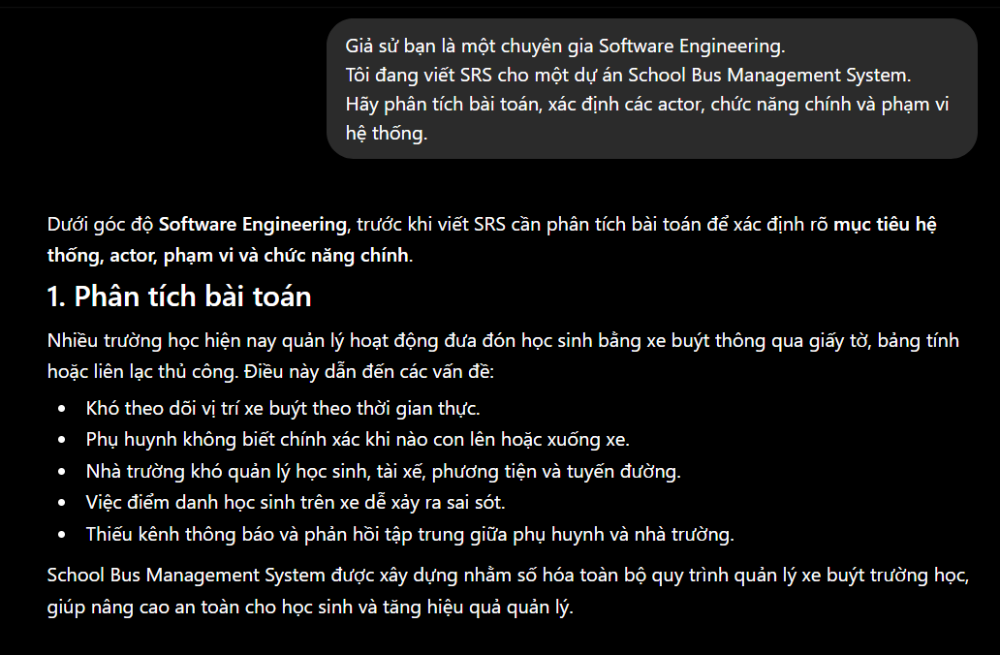
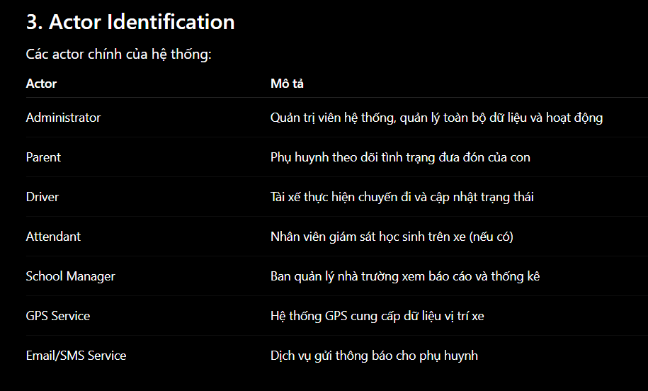
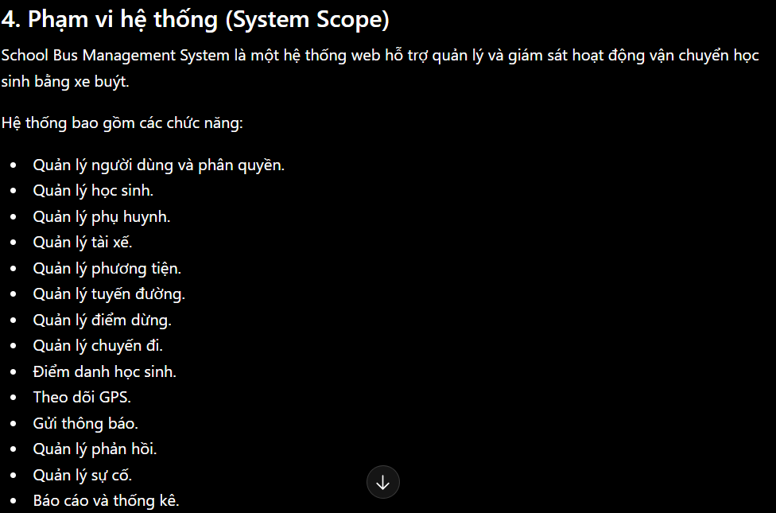
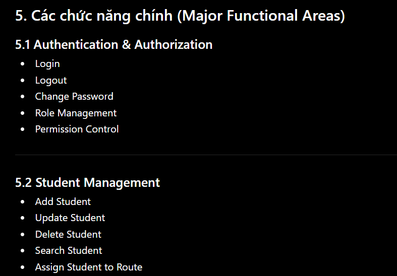
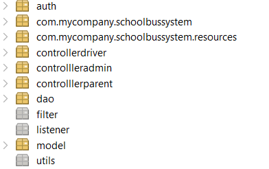
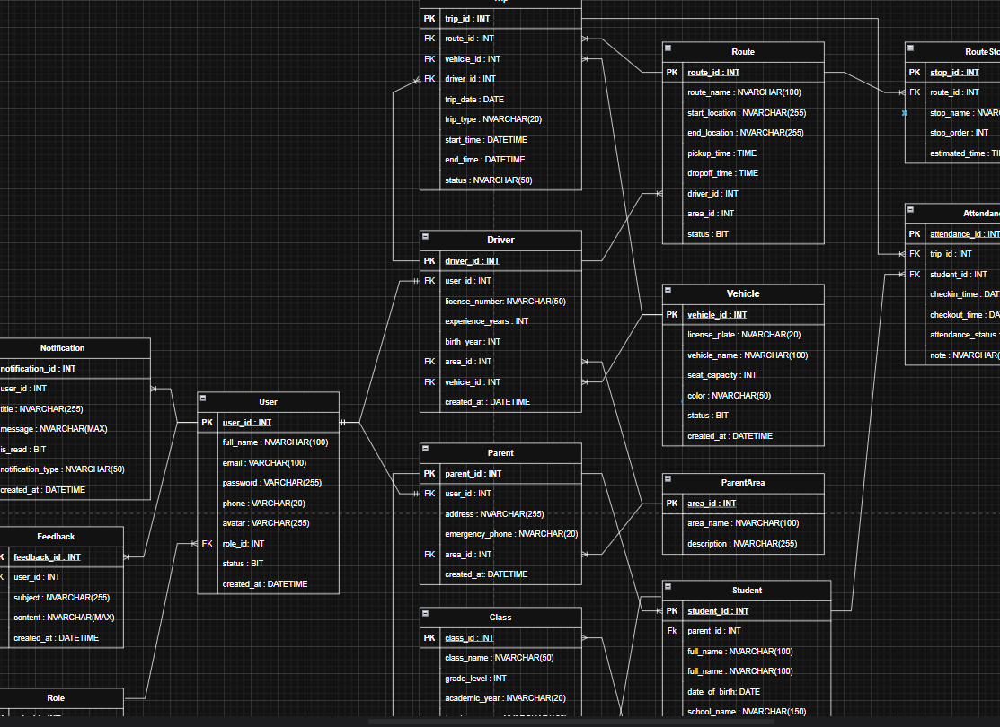
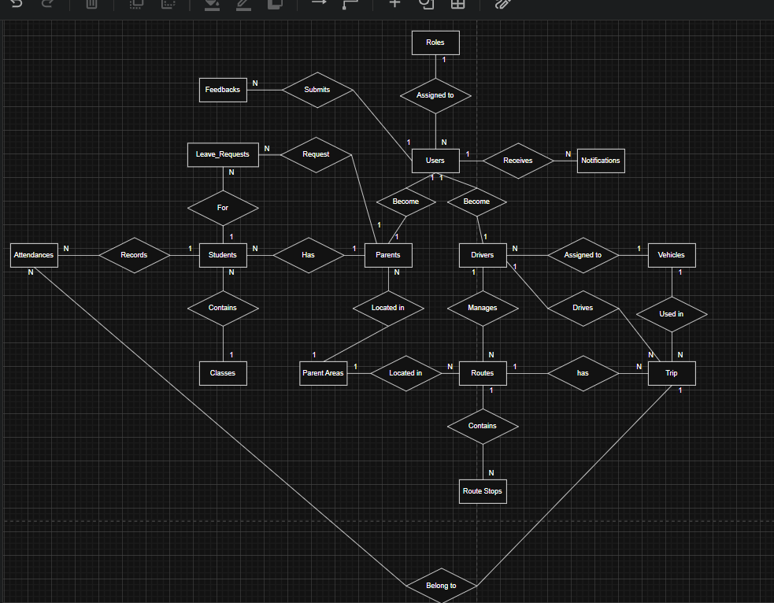

# AI Audit Log

## 1. Thông tin chung

| Thông tin | Nội dung |
|---|---|
| Môn học | Software development project |
| Mã môn học | SWP391 |
| Lớp | SE20A04 |
| Học kỳ | SU26 |
| Tên bài tập / Project | School Bus System |
| Tên sinh viên / Nhóm | Trần Quốc Huy/Group 7 |
| MSSV / Danh sách MSSV | DE200146 |
| Giảng viên hướng dẫn | Lê Thiện Nhật Quang |
| Ngày bắt đầu | 19/05/2026 |
| Ngày hoàn thành |  |

---

## 2. Công cụ AI đã sử dụng

Đánh dấu các công cụ AI đã sử dụng trong quá trình thực hiện bài tập/project.

- [x] ChatGPT
- [ ] Gemini
- [x] Claude
- [ ] GitHub Copilot
- [ ] Cursor
- [ ] Antigravity
- [ ] Perplexity
- [ ] Microsoft Copilot
- [x] Công cụ khác: Canva

---

## 3. Mục tiêu sử dụng AI

- Phân tích yêu cầu bài toán
- Gợi ý ý tưởng giải pháp
- Thiết kế database
- Thiết kế giao diện
- Debug lỗi
- Viết test case
- Kiểm tra bảo mật
- Viết báo cáo
- Chuẩn bị slide thuyết trình

### Mô tả mục tiêu sử dụng AI

```text
Viết tại đây...

## 4. Nhật ký sử dụng AI chi tiết

> Mỗi lần sử dụng AI cho một phần quan trọng của bài tập/project, sinh viên cần ghi lại theo mẫu bên dưới.  
> Sinh viên/nhóm có thể nhân bản mẫu “Lần sử dụng AI” nhiều lần tùy theo số lần sử dụng AI thực tế.

---

### Lần sử dụng AI số 1

| Nội dung | Thông tin |
|---|---|
| Ngày sử dụng | 25/05/2026 |
| Công cụ AI | ChatGPT |
| Mục đích sử dụng | Phân tích yêu cầu nghiệp vụ của hệ thống quản lý xe buýt trường học |
| Phần việc liên quan | Requirement |
| Mức độ sử dụng | Hỗ trợ ý tưởng |

#### 4.1. Prompt đã sử dụng
```text
Dán nguyên văn prompt đã hỏi AI tại đây.
```
Giả sử bạn là một chuyên gia Software Engineering.
Tôi đang viết SRS cho một dự án School Bus Management System.
Hãy phân tích bài toán, xác định các actor, chức năng chính và phạm vi hệ thống.

#### 4.2. Kết quả AI gợi ý

Tóm tắt nội dung AI đã trả lời hoặc gợi ý.

```text
Viết tại đây...
```
AI đề xuất hệ thống gồm các tác nhân:
    Administrator
    Parent
    Driver
    Student

Và các chức năng chính:
    Quản lý học sinh
    Quản lý phụ huynh
    Quản lý tài xế
    Quản lý xe buýt
    Quản lý tuyến đường
    Theo dõi vị trí GPS
    Gửi thông báo

AI cũng đề xuất phạm vi dự án và mục tiêu của hệ thống.

#### 4.3. Phần sinh viên/nhóm đã sử dụng từ AI

Mô tả rõ phần nào được sử dụng lại từ gợi ý của AI.

```text
Viết tại đây...
```
Nhóm sử dụng danh sách actor và các module được AI đề xuất làm cơ sở để xây dựng Scope và Use Case Diagram.

#### 4.4. Phần sinh viên/nhóm tự chỉnh sửa hoặc cải tiến

Mô tả sinh viên/nhóm đã thay đổi, kiểm tra, sửa lỗi hoặc cải tiến gì so với gợi ý ban đầu của AI.

```text
Viết tại đây...
```
Nhóm bổ sung thêm chức năng quản lý lớp học (Class Management) và chức năng điểm danh học sinh lên/xuống xe.
Nhóm cũng điều chỉnh phạm vi dự án phù hợp với thời gian thực hiện môn học.

#### 4.5. Minh chứng

| Loại minh chứng | Nội dung |
|---|---|
| Link commit | commit tạo tài liệu Requirement |
| File liên quan | SRS.docs |
| Screenshot |  /  /  /  |
| Kết quả chạy/test | Không áp dụng |
| Link video demo | Không áp dụng |
| Ghi chú khác | Sử dụng ở giai đoạn phân tích yêu cầu |

#### 4.6. Nhận xét cá nhân/nhóm

Sinh viên/nhóm học được gì sau lần sử dụng AI này?

```text
Viết tại đây...
```
Nhóm hiểu rõ hơn cách xác định actor, chức năng và phạm vi của hệ thống trước khi bắt đầu thiết kế.
---

### Lần sử dụng AI số 2

| Nội dung | Thông tin |
|---|---|
| Ngày sử dụng | 25/05/2026 |
| Công cụ AI | ChatGPT |
| Mục đích sử dụng | Gợi ý các chức năng chính như quản lý học sinh, phụ huynh, tài xế, tuyến đường và GPS |
| Phần việc liên quan | Requirement |
| Mức độ sử dụng | Hỗ trợ một phần |

#### 4.1. Prompt đã sử dụng

```text
Dán nguyên văn prompt đã hỏi AI tại đây.
```
Hãy đề xuất kiến trúc hệ thống và các module cho School Bus Management System sử dụng Spring Boot, HTML, CSS và SQL Server.

#### 4.2. Kết quả AI gợi ý

```text
Viết tại đây...
```
AI đề xuất kiến trúc MVC gồm Controller, Service, Repository và Database.
Đồng thời gợi ý các module như User Management, Student Management,
Vehicle Management, Route Management, Trip Management và Notification Management.

#### 4.3. Phần sinh viên/nhóm đã sử dụng từ AI

```text
Viết tại đây...
```
Nhóm sử dụng mô hình MVC và danh sách module để lập kế hoạch phát triển hệ thống.

#### 4.4. Phần sinh viên/nhóm tự chỉnh sửa hoặc cải tiến

```text
Viết tại đây...
```
Nhóm bổ sung module GPS Tracking và Attendance Management.

#### 4.5. Minh chứng

| Loại minh chứng | Nội dung |
|---|---|
| Link commit | commit khởi tạo project |
| File liên quan | Project Structure |
| Screenshot |  |
| Kết quả chạy/test |Project Spring Boot khởi động thành công  |
| Link video demo | Không áp dụng |
| Ghi chú khác | Thiết kế kiến trúc |

#### 4.6. Nhận xét cá nhân/nhóm

```text
Viết tại đây...
```
Nhóm hiểu rõ hơn cách tổ chức source code theo mô hình MVC.

---

### Lần sử dụng AI số 3

| Nội dung | Thông tin |
|---|---|
| Ngày sử dụng | 26/05/2026 |
| Công cụ AI | ChatGPT |
| Mục đích sử dụng | Đề xuất kiến trúc hệ thống và mô hình phân quyền người dùng |
| Phần việc liên quan | Design |
| Mức độ sử dụng | Hỗ trợ nhiều |

#### 4.1. Prompt đã sử dụng

```text
Dán nguyên văn prompt đã hỏi AI tại đây.
```
Hãy thiết kế cơ sở dữ liệu cho School Bus Management System, bao gồm các bảng, khóa chính, khóa ngoại và quan hệ giữa các bảng.

#### 4.2. Kết quả AI gợi ý

```text
Viết tại đây...
```
AI đề xuất các bảng User, Student, Parent, Driver, Vehicle,
Route, Trip, Attendance, Notification và quan hệ giữa chúng.

#### 4.3. Phần sinh viên/nhóm đã sử dụng từ AI

```text
Viết tại đây...
```
Nhóm sử dụng danh sách bảng và quan hệ để xây dựng ERD ban đầu.

#### 4.4. Phần sinh viên/nhóm tự chỉnh sửa hoặc cải tiến

```text
Viết tại đây...
```
Nhóm bổ sung bảng Classes, Attendance và RouteStops.
Nhóm điều chỉnh lại một số quan hệ để phù hợp với yêu cầu thực tế.

#### 4.5. Minh chứng

| Loại minh chứng | Nội dung |
|---|---|
| Link commit | Commit tạo database |
| File liên quan | Database.sql |
| Screenshot |  |
| Kết quả chạy/test | Database tạo thành công |
| Link video demo | Không áp dụng |
| Ghi chú khác | Database Design |

#### 4.6. Nhận xét cá nhân/nhóm

```text
Viết tại đây...
```
Nhóm hiểu rõ hơn về cách xây dựng quan hệ dữ liệu trong hệ thống quản lý.
---

### Lần sử dụng AI số 4

| Nội dung | Thông tin |
|---|---|
| Ngày sử dụng | 26/05/2026 |
| Công cụ AI | Claude |
| Mục đích sử dụng | Thiết kế cơ sở dữ liệu, xác định các bảng và mối quan hệ giữa các thực thể |
| Phần việc liên quan | Database |
| Mức độ sử dụng | Hỗ trợ một phần |

#### 4.1. Prompt đã sử dụng

```text
Dán nguyên văn prompt đã hỏi AI tại đây.
```
HTôi đang xây dựng một School Bus Management System.

Hãy thiết kế cơ sở dữ liệu cho hệ thống, bao gồm các bảng chính, khóa chính, khóa ngoại và các mối quan hệ giữa các thực thể như Student, Parent, Driver, Vehicle, Route, Trip và Notification.

Đề xuất mô hình dữ liệu phù hợp để dễ dàng mở rộng trong tương lai.

#### 4.2. Kết quả AI gợi ý

```text
Viết tại đây...
```
AI đề xuất các bảng chính:
    User
    Student
    Parent
    Driver
    Vehicle
    Route
    Trip
    Notification

AI cũng đề xuất các khóa chính, khóa ngoại và mối quan hệ giữa các bảng.

#### 4.3. Phần sinh viên/nhóm đã sử dụng từ AI

```text
Viết tại đây...
```
Nhóm sử dụng danh sách bảng và các mối quan hệ được AI đề xuất làm cơ sở để xây dựng ERD ban đầu và triển khai database trên SQL Server.

#### 4.4. Phần sinh viên/nhóm tự chỉnh sửa hoặc cải tiến

```text
Viết tại đây...
```
Nhóm bổ sung thêm các bảng Attendance, Class và RouteStop để đáp ứng yêu cầu nghiệp vụ thực tế.
Một số mối quan hệ được điều chỉnh lại sau khi phân tích chi tiết quy trình đưa đón học sinh.

#### 4.5. Minh chứng

| Loại minh chứng | Nội dung |
|---|---|
| Link commit | Commit tạo cấu trúc database ban đầu |
| File liên quan | Database.sql, ERD.drawio |
| Screenshot |  |
| Kết quả chạy/test | Database được tạo thành công trên SQL Server |
| Link video demo | Không áp dụng |
| Ghi chú khác | Database Design Phase |

#### 4.6. Nhận xét cá nhân/nhóm

```text
Viết tại đây...
```
Thông qua việc sử dụng AI, nhóm có thêm định hướng ban đầu trong thiết kế cơ sở dữ liệu, từ đó tiết kiệm thời gian phân tích các thực thể và mối quan hệ. Tuy nhiên, nhóm vẫn phải tự đánh giá, chỉnh sửa và bổ sung để phù hợp với yêu cầu thực tế của dự án.
---

### Lần sử dụng AI số 5

| Nội dung | Thông tin |
|---|---|
| Ngày sử dụng | 29/05/2026 |
| Công cụ AI | Claude |
| Mục đích sử dụng | Hỗ trợ xây dựng ERD Chen Diagram |
| Phần việc liên quan | Database |
| Mức độ sử dụng | Hỗ trợ một phần |

#### 4.1. Prompt đã sử dụng

```text
Dán nguyên văn prompt đã hỏi AI tại đây.
```
Hướng dẫn tôi xây dựng ERD Chen Diagram cho School Bus Management SystemSystem.

#### 4.2. Kết quả AI gợi ý

```text
Viết tại đây...
```
AI giải thích:
    Supertype: User
    Subtype: Parent, Driver, Administrator

và cách biểu diễn ISA trong ERD Chen.

#### 4.3. Phần sinh viên/nhóm đã sử dụng từ AI

```text
Viết tại đây...
```
Nhóm chỉ áp dụng các kiến thức đã có và xây dựng ERD Chen của hệ thống.
Không sử dụng ISA.

#### 4.4. Phần sinh viên/nhóm tự chỉnh sửa hoặc cải tiến

```text
Viết tại đây...
```
Nhóm thay đổi một số thuộc tính riêng của Driver và Parent sau khi phân tích nghiệp vụ. và xóa phần ISA được tạo.

#### 4.5. Minh chứng

| Loại minh chứng | Nội dung |
|---|---|
| Link commit | Commit cập nhật ERD |
| File liên quan | ERD_Chen.drawio |
| Screenshot |  |
| Kết quả chạy/test | Không áp dụng |
| Link video demo | Không áp dụng |
| Ghi chú khác | Database Modeling |

#### 4.6. Nhận xét cá nhân/nhóm

```text
Viết tại đây...
```
Nhóm hiểu rõ hơn về kế thừa dữ liệu trong thiết kế cơ sở dữ liệu.
---

### Lần sử dụng AI số 6

| Nội dung | Thông tin |
|---|---|
| Ngày sử dụng | 29/05/2026 |
| Công cụ AI | ChatGPT / Claude |
| Mục đích sử dụng | Đề xuất bố cục giao diện Dashboard cho Administrator, Parent và Driver |
| Phần việc liên quan | Frontend |
| Mức độ sử dụng | Hỗ trợ ý tưởng |

#### 4.1. Prompt đã sử dụng

```text
Dán nguyên văn prompt đã hỏi AI tại đây.
```
Hãy đề xuất giao diện Dashboard cho Administrator của School Bus Management System.

#### 4.2. Kết quả AI gợi ý

```text
Viết tại đây...
```
AI đề xuất bố cục tổng thể cho giao diện quản trị.

#### 4.3. Phần sinh viên/nhóm đã sử dụng từ AI

```text
Viết tại đây...
```
Nhóm sử dụng bố cục Dashboard và các thành phần thống kê.

#### 4.4. Phần sinh viên/nhóm tự chỉnh sửa hoặc cải tiến

```text
Viết tại đây...
```
Nhóm thay đổi màu sắc, logo và thiết kế lại các thẻ thống kê theo phong cách riêng.

#### 4.5. Minh chứng

| Loại minh chứng | Nội dung |
|---|---|
| Link commit | Không áp dụng |
| File liên quan | dashboard.html |
| Screenshot | giao diện dashboard |
| Kết quả chạy/test | Không áp dụng |
| Link video demo | Không áp dụng |
| Ghi chú khác | UI Design |

### Lần sử dụng AI số 7

| Nội dung | Thông tin |
|---|---|
| Ngày sử dụng | 30/05/2026 |
| Công cụ AI | ChatGPT |
| Mục đích sử dụng | Hỗ trợ debug lỗi trong quá trình xây dựng chức năng đăng nhập và phân quyền |
| Phần việc liên quan | Debug |
| Mức độ sử dụng | Hỗ trợ một phần |

#### 4.1. Prompt đã sử dụng

```text
Dán nguyên văn prompt đã hỏi AI tại đây.
```
Những rủi ro bảo mật phổ biến trong hệ thống quản lý xe buýt trường học là gì?

#### 4.2. Kết quả AI gợi ý

```text
Viết tại đây...
```
AI đề xuất:
    SQL Injection
    XSS
    Broken Authentication
    Session Hijacking

#### 4.3. Phần sinh viên/nhóm đã sử dụng từ AI

```text
Viết tại đây...
```
Nhóm dùng danh sách này để đánh giá hệ thống.

#### 4.4. Phần sinh viên/nhóm tự chỉnh sửa hoặc cải tiến

```text
Viết tại đây...
```
Bổ sung xác thực bằng Spring Security và mã hóa mật khẩu.

#### 4.5. Minh chứng

| Loại minh chứng | Nội dung |
|---|---|
| Link commit | Không áp dụng |
| File liên quan | UserService.java, SecurityConfig.java |
| Screenshot |  |
| Kết quả chạy/test | Kiểm tra đăng nhập và phân quyền thành công |
| Link video demo | Không áp dụng |
| Ghi chú khác | Security Review |

#### 4.6. Nhận xét cá nhân/nhóm

```text
Viết tại đây...
```
Nhóm hiểu rõ hơn về các lỗ hổng bảo mật phổ biến của ứng dụng web.
---

### Lần sử dụng AI số 8

| Nội dung | Thông tin |
|---|---|
| Ngày sử dụng | 02/06/2026 |
| Công cụ AI | ChatGPT |
| Mục đích sử dụng | Viết test case cho chức năng đăng nhập, quản lý học sinh và quản lý tuyến xe |
| Phần việc liên quan | Testing |
| Mức độ sử dụng | Sinh chính nội dung |

#### 4.1. Prompt đã sử dụng

```text
Dán nguyên văn prompt đã hỏi AI tại đây.
```
Hãy viết Test Case cho chức năng đăng nhập của School Bus Management System.

#### 4.2. Kết quả AI gợi ý

```text
Viết tại đây...
```
AI tạo các trường hợp:
    Đăng nhập thành công
    Sai mật khẩu
    Tài khoản không tồn tại
    Bỏ trống dữ liệu

#### 4.3. Phần sinh viên/nhóm đã sử dụng từ AI

```text
Viết tại đây...
```
Nhóm sử dụng bộ test case làm cơ sở cho kiểm thử thủ công.

#### 4.4. Phần sinh viên/nhóm tự chỉnh sửa hoặc cải tiến

```text
Viết tại đây...
```
Bổ sung các trường hợp khóa tài khoản và phân quyền người dùng.

#### 4.5. Minh chứng

| Loại minh chứng | Nội dung |
|---|---|
| Link commit | Không áp dụng |
| File liên quan | TestCases.xlsx |
| Screenshot |  |
| Kết quả chạy/test | Các test case được thực hiện và ghi nhận kết quả Pass/Fail |
| Link video demo | Không áp dụng |
| Ghi chú khác | Testing Phase |

#### 4.6. Nhận xét cá nhân/nhóm

```text
Viết tại đây...
```
Nhóm hiểu cách xây dựng test case dựa trên yêu cầu chức năng.
---

### Lần sử dụng AI số 9

| Nội dung | Thông tin |
|---|---|
| Ngày sử dụng | 01/06/2026 |
| Công cụ AI | Claude |
| Mục đích sử dụng | Kiểm tra các rủi ro bảo mật và đề xuất biện pháp bảo vệ dữ liệu người dùng |
| Phần việc liên quan | Testing |
| Mức độ sử dụng | Hỗ trợ nhiều |

#### 4.1. Prompt đã sử dụng

```text
Dán nguyên văn prompt đã hỏi AI tại đây.
```
Tôi đang phát triển một School Bus Management System sử dụng Spring Boot và SQL Server.

Hãy phân tích các rủi ro bảo mật có thể xảy ra trong hệ thống, đặc biệt đối với chức năng đăng nhập, quản lý người dùng và lưu trữ dữ liệu.

Đề xuất các biện pháp bảo mật phù hợp để bảo vệ thông tin học sinh, phụ huynh và tài xế.

#### 4.2. Kết quả AI gợi ý

```text
Viết tại đây...
```
AI xác định một số rủi ro bảo mật phổ biến:
    SQL Injection
    Cross-Site Scripting (XSS)
    Broken Authentication
    Broken Access Control
    Session Hijacking
    Lưu mật khẩu dạng plain text
    Rò rỉ dữ liệu cá nhân

AI cũng đề xuất các biện pháp bảo vệ:
    Sử dụng Spring Security
    Mã hóa mật khẩu bằng BCrypt
    Phân quyền theo Role
    Kiểm tra dữ liệu đầu vào
    Sử dụng HTTPS
    Thiết lập Session Timeout

#### 4.3. Phần sinh viên/nhóm đã sử dụng từ AI

```text
Viết tại đây...
```
Nhóm sử dụng danh sách rủi ro bảo mật làm cơ sở để rà soát hệ thống và xây dựng checklist kiểm tra bảo mật trước khi nghiệm thu.

#### 4.4. Phần sinh viên/nhóm tự chỉnh sửa hoặc cải tiến

```text
Viết tại đây...
```
Nhóm nghiên cứu thêm tài liệu Spring Security và triển khai cơ chế phân quyền theo vai trò Administrator, Parent và Driver.
Ngoài ra nhóm bổ sung quy tắc kiểm tra dữ liệu đầu vào và áp dụng mã hóa mật khẩu bằng BCrypt.

#### 4.5. Minh chứng

| Loại minh chứng | Nội dung |
|---|---|
| Link commit | Không áp dụng |
| File liên quan | SecurityConfig.java, UserService.java, User.java |
| Screenshot |  |
| Kết quả chạy/test | Kiểm tra đăng nhập, phân quyền và mã hóa mật khẩu thành công |
| Link video demo | Không áp dụng |
| Ghi chú khác | Security Review và Security Testing |

#### 4.6. Nhận xét cá nhân/nhóm

```text
Viết tại đây...
```
Nhóm hiểu rõ hơn về các lỗ hổng bảo mật phổ biến trong ứng dụng web và tầm quan trọng của việc bảo vệ dữ liệu người dùng. AI giúp nhóm nhận diện các rủi ro nhanh hơn, nhưng việc lựa chọn và triển khai giải pháp vẫn do nhóm tự thực hiện và kiểm chứng.
---

### Lần sử dụng AI số 10

| Nội dung | Thông tin |
|---|---|
| Ngày sử dụng | 01/06/2026 |
| Công cụ AI | ChatGPT / Khác: Canva |
| Mục đích sử dụng | Hỗ trợ viết báo cáo dự án, xây dựng nội dung slide và chuẩn bị kịch bản thuyết trình |
| Phần việc liên quan | Report / Presentation |
| Mức độ sử dụng | Sinh chính nội dung |

#### 4.1. Prompt đã sử dụng

```text
Dán nguyên văn prompt đã hỏi AI tại đây.
```
Tôi đang thực hiện dự án School Bus Management System.

Hãy giúp tôi:
1. Xây dựng cấu trúc báo cáo dự án theo chuẩn Software Engineering.
2. Chia nội dung thành các phần phù hợp cho 5 thành viên trình bày.
3. Đề xuất bố cục slide thuyết trình.
4. Viết script trình bày ngắn cho từng thành viên.

#### 4.2. Kết quả AI gợi ý

```text
Viết tại đây...
```
AI đề xuất:
    Cấu trúc báo cáo gồm Introduction, Requirement Analysis, System Design, Implementation, Testing và Conclusion.
    Chia nội dung thành 5 phần cho 5 thành viên.
    Đề xuất bố cục slide theo trình tự phân tích → thiết kế → triển khai → kiểm thử.
    Soạn nội dung thuyết trình mẫu cho từng phần.

#### 4.3. Phần sinh viên/nhóm đã sử dụng từ AI

```text
Viết tại đây...
```
Nhóm sử dụng cấu trúc báo cáo, bố cục slide và nội dung kịch bản được AI đề xuất làm nền tảng cho tài liệu cuối cùng.
Canva được sử dụng để tạo slide dựa trên nội dung đã chuẩn bị.

#### 4.4. Phần sinh viên/nhóm tự chỉnh sửa hoặc cải tiến

```text
Viết tại đây...
```
Nhóm chỉnh sửa lại nội dung để phù hợp với sản phẩm thực tế đã xây dựng.
Các hình ảnh giao diện, sơ đồ ERD, Use Case Diagram, System Architecture và kết quả kiểm thử được bổ sung từ sản phẩm của nhóm.
Kịch bản thuyết trình được điều chỉnh để phù hợp với thời lượng trình bày và phong cách của từng thành viên.

#### 4.5. Minh chứng

| Loại minh chứng | Nội dung |
|---|---|
| Link commit | Không áp dụng |
| File liên quan | Presentation.pptx |
| Screenshot |  |
| Kết quả chạy/test | Các hình ảnh kết quả chạy hệ thống được đưa vào báo cáo và slide |
| Link video demo | Không áp dụng |
| Ghi chú khác | AI được sử dụng trong giai đoạn hoàn thiện tài liệu và chuẩn bị thuyết trình dự án |

#### 4.6. Nhận xét cá nhân/nhóm

```text
Viết tại đây...
```
AI giúp nhóm tiết kiệm đáng kể thời gian trong việc xây dựng cấu trúc báo cáo, chuẩn bị slide và kịch bản thuyết trình.
Thông qua quá trình sử dụng AI, nhóm học được cách tổ chức nội dung kỹ thuật một cách logic, dễ hiểu và phù hợp với yêu cầu của môn học. Tuy nhiên toàn bộ nội dung cuối cùng đều được nhóm kiểm tra, chỉnh sửa và bổ sung dựa trên sản phẩm thực tế đã phát triển.
---

## 4b. Nhật ký AI theo ngày (hỏi kiến thức nền tảng BE/FE/Database)

> Ngoài các "Lần sử dụng AI" ở mục 4 (gắn với một deliverable cụ thể), trong suốt quá trình làm project Trần Quốc Huy còn thường xuyên hỏi AI (chủ yếu ChatGPT) để ôn lại/ tra cứu kiến thức nền tảng về Backend, Frontend, Spring Boot và Database SQL. Đây là các câu hỏi mang tính tìm hiểu khái niệm, không gắn với một commit/file cụ thể, nên không lưu lại toàn văn cuộc trò chuyện. Bảng dưới đây tóm tắt lại các lần hỏi theo ngày dựa trên trí nhớ và ghi chú cá nhân.

| STT | Ngày | Chủ đề | Nội dung hỏi AI (tóm tắt) | Mục đích sử dụng |
|---:|---|---|---|---|
| 1 | 19/05/2026 | Backend - Servlet | Vòng đời của Servlet (init, service, destroy) hoạt động như thế nào? | Hiểu cách Tomcat quản lý Servlet để debug lỗi session/scope |
| 2 | 20/05/2026 | Backend - DAO Pattern | DAO Pattern khác gì với việc gọi SQL trực tiếp trong Servlet? | Tổ chức lại tầng truy xuất dữ liệu cho rõ ràng hơn |
| 3 | 21/05/2026 | Backend - JDBC | JDBC Connection Pooling là gì, vì sao cần dùng thay vì mở connection mỗi lần? | Tham khảo để hiểu DBContext đang dùng kiểu kết nối nào |
| 4 | 22/05/2026 | Frontend - JSP | JSP và Servlet khác nhau ở điểm nào trong mô hình MVC? | Hiểu rõ vai trò của các trang .jsp trong project |
| 5 | 23/05/2026 | Frontend - HTML/CSS | Cách validate form HTML phía client trước khi submit lên server? | Tham khảo cách kiểm tra dữ liệu nhập ở các trang add/update |
| 6 | 24/05/2026 | Database - SQL | Sự khác biệt giữa INNER JOIN và LEFT JOIN, khi nào nên dùng cái nào? | Ôn lại kiến thức để viết truy vấn báo cáo (reports.jsp) |
| 7 | 25/05/2026 | Database - Chuẩn hóa | Chuẩn hóa dữ liệu (1NF, 2NF, 3NF) là gì và áp dụng vào thiết kế bảng ra sao? | Đối chiếu lại cấu trúc bảng Student/Parent/Driver |
| 8 | 26/05/2026 | Spring Boot - So sánh | Spring Boot xử lý dependency injection khác gì so với Servlet thuần? | Tìm hiểu thêm kiến thức ngoài lề, không áp dụng trực tiếp vào project |
| 9 | 27/05/2026 | Backend - Session | HttpSession dùng để lưu trạng thái đăng nhập như thế nào, rủi ro gì nếu không kiểm soát? | Ôn kiến thức trước khi review lại LoginServlet |
| 10 | 28/05/2026 | Database - Transaction | Transaction trong SQL Server (commit/rollback) hoạt động ra sao? | Tìm hiểu để hiểu rõ hơn về tính toàn vẹn dữ liệu khi cập nhật nhiều bảng |
| 11 | 29/05/2026 | Backend - Exception Handling | Best practice xử lý exception trong tầng DAO là gì? | Tham khảo cách viết try-catch hợp lý hơn cho DAO |
| 12 | 30/05/2026 | Frontend - Bootstrap | Bootstrap grid system hoạt động như thế nào để chia layout responsive? | Ôn lại kiến thức để hiểu cách các trang admin đang bố trí |
| 13 | 31/05/2026 | Database - Index | Index trong SQL Server giúp tăng tốc truy vấn như thế nào, khi nào nên tạo index? | Tìm hiểu lý thuyết, chưa áp dụng trực tiếp |
| 14 | 01/06/2026 | Backend - MVC | Mô hình MVC trong ứng dụng Java Web khác gì so với MVC trong framework hiện đại? | Ôn lại lý thuyết kiến trúc trước khi review code Servlet |
| 15 | 02/06/2026 | Spring Boot - REST | RESTful API trong Spring Boot trả response JSON như thế nào, khác gì với Servlet trả HTML? | So sánh kiến thức, không áp dụng vì project dùng HTML response |
| 16 | 03/06/2026 | Database - Stored Procedure | Stored Procedure trong SQL Server có ưu/nhược điểm gì so với viết SQL trong code Java? | Tìm hiểu thêm kiến thức lý thuyết |
| 17 | 04/06/2026 | Backend - Authentication | Phân biệt Authentication và Authorization trong ứng dụng web? | Ôn lại để hiểu rõ luồng phân quyền Admin/Driver/Parent |
| 18 | 05/06/2026 | Frontend - JavaScript | JavaScript event handling (onclick, onsubmit) hoạt động như thế nào trên form? | Tham khảo lý thuyết về xử lý sự kiện phía client |
| 19 | 06/06/2026 | Database - ERD | Cách đọc và vẽ ERD chuẩn (ký hiệu Crow's Foot) như thế nào? | Ôn lại kiến thức trước khi đối chiếu ERD đã vẽ |
| 20 | 07/06/2026 | Backend - Design Pattern | Singleton Pattern là gì, có phù hợp áp dụng cho DBContext không? | Tìm hiểu lý thuyết design pattern liên quan đến kết nối DB |
| 21 | 08/06/2026 | Backend - Servlet | Vòng đời của Servlet (init, service, destroy) hoạt động như thế nào? | Hiểu cách Tomcat quản lý Servlet để debug lỗi session/scope |
| 22 | 09/06/2026 | Backend - DAO Pattern | DAO Pattern khác gì với việc gọi SQL trực tiếp trong Servlet? | Tổ chức lại tầng truy xuất dữ liệu cho rõ ràng hơn |
| 23 | 10/06/2026 | Backend - JDBC | JDBC Connection Pooling là gì, vì sao cần dùng thay vì mở connection mỗi lần? | Tham khảo để hiểu DBContext đang dùng kiểu kết nối nào |
| 24 | 11/06/2026 | Frontend - JSP | JSP và Servlet khác nhau ở điểm nào trong mô hình MVC? | Hiểu rõ vai trò của các trang .jsp trong project |
| 25 | 12/06/2026 | Frontend - HTML/CSS | Cách validate form HTML phía client trước khi submit lên server? | Tham khảo cách kiểm tra dữ liệu nhập ở các trang add/update |
| 26 | 13/06/2026 | Database - SQL | Sự khác biệt giữa INNER JOIN và LEFT JOIN, khi nào nên dùng cái nào? | Ôn lại kiến thức để viết truy vấn báo cáo (reports.jsp) |
| 27 | 14/06/2026 | Database - Chuẩn hóa | Chuẩn hóa dữ liệu (1NF, 2NF, 3NF) là gì và áp dụng vào thiết kế bảng ra sao? | Đối chiếu lại cấu trúc bảng Student/Parent/Driver |
| 28 | 15/06/2026 | Spring Boot - So sánh | Spring Boot xử lý dependency injection khác gì so với Servlet thuần? | Tìm hiểu thêm kiến thức ngoài lề, không áp dụng trực tiếp vào project |
| 29 | 16/06/2026 | Backend - Session | HttpSession dùng để lưu trạng thái đăng nhập như thế nào, rủi ro gì nếu không kiểm soát? | Ôn kiến thức trước khi review lại LoginServlet |
| 30 | 17/06/2026 | Database - Transaction | Transaction trong SQL Server (commit/rollback) hoạt động ra sao? | Tìm hiểu để hiểu rõ hơn về tính toàn vẹn dữ liệu khi cập nhật nhiều bảng |
| 31 | 18/06/2026 | Backend - Exception Handling | Best practice xử lý exception trong tầng DAO là gì? | Tham khảo cách viết try-catch hợp lý hơn cho DAO |
| 32 | 19/06/2026 | Frontend - Bootstrap | Bootstrap grid system hoạt động như thế nào để chia layout responsive? | Ôn lại kiến thức để hiểu cách các trang admin đang bố trí |
| 33 | 20/06/2026 | Database - Index | Index trong SQL Server giúp tăng tốc truy vấn như thế nào, khi nào nên tạo index? | Tìm hiểu lý thuyết, chưa áp dụng trực tiếp |
| 34 | 21/06/2026 | Backend - MVC | Mô hình MVC trong ứng dụng Java Web khác gì so với MVC trong framework hiện đại? | Ôn lại lý thuyết kiến trúc trước khi review code Servlet |
| 35 | 22/06/2026 | Spring Boot - REST | RESTful API trong Spring Boot trả response JSON như thế nào, khác gì với Servlet trả HTML? | So sánh kiến thức, không áp dụng vì project dùng HTML response |
| 36 | 23/06/2026 | Database - Stored Procedure | Stored Procedure trong SQL Server có ưu/nhược điểm gì so với viết SQL trong code Java? | Tìm hiểu thêm kiến thức lý thuyết |
| 37 | 24/06/2026 | Backend - Authentication | Phân biệt Authentication và Authorization trong ứng dụng web? | Ôn lại để hiểu rõ luồng phân quyền Admin/Driver/Parent |
| 38 | 25/06/2026 | Frontend - JavaScript | JavaScript event handling (onclick, onsubmit) hoạt động như thế nào trên form? | Tham khảo lý thuyết về xử lý sự kiện phía client |
| 39 | 26/06/2026 | Database - ERD | Cách đọc và vẽ ERD chuẩn (ký hiệu Crow's Foot) như thế nào? | Ôn lại kiến thức trước khi đối chiếu ERD đã vẽ |
| 40 | 27/06/2026 | Backend - Design Pattern | Singleton Pattern là gì, có phù hợp áp dụng cho DBContext không? | Tìm hiểu lý thuyết design pattern liên quan đến kết nối DB |

**Ghi chú:** Phần lớn các câu hỏi này phục vụ mục đích học/ôn kiến thức (không sinh code, không sinh nội dung nộp bài trực tiếp), nên không tính vào "mức độ sử dụng AI" ở mục 5 cho từng deliverable. Một số nội dung (JSP/MVC, Session, Authentication, Index, ERD) có được dùng làm cơ sở tham khảo khi review lại các phần Database, Login, Report.

---

## 5. Bảng tổng hợp mức độ sử dụng AI

Đánh dấu mức độ AI hỗ trợ ở từng hạng mục.

| Hạng mục | Không dùng AI | AI hỗ trợ ít | AI hỗ trợ nhiều | AI sinh chính | Ghi chú |
|---|:---:|:---:|:---:|:---:|---|
| Phân tích yêu cầu |  |  | x |  |  |
| Viết user story/use case |  |  | x |  |  |
| Thiết kế database |  |  | x |  |  |
| Thiết kế kiến trúc hệ thống |  |  | x |  |  |
| Thiết kế giao diện |  |  | x |  |  |
| Code frontend | x |  |  |  |  |
| Code backend | x |  |  |  |  |
| Debug lỗi |  | x |  |  |  |
| Viết test case |  |  |  | x |  |
| Kiểm thử sản phẩm |  | x |  |  |  |
| Tối ưu code | x |  |  |  |  |
| Viết báo cáo |  |  | x |  |  |
| Làm slide thuyết trình |  |  |  | x |  |

---

## 6. Các lỗi hoặc hạn chế từ AI

Ghi lại các trường hợp AI trả lời sai, thiếu, chưa phù hợp hoặc sinh code không chạy.

| STT | Lỗi/hạn chế từ AI | Cách phát hiện | Cách xử lý/cải tiến |
|---:|---|---|---|
| 1 | AI đề xuất mô hình cơ sở dữ liệu chưa đầy đủ, thiếu một số thực thể như Attendance và Class phục vụ nghiệp vụ điểm danh học sinh. | Nhóm đối chiếu với yêu cầu trong SRS và nhận thấy một số chức năng không thể triển khai với cấu trúc dữ liệu được đề xuất. | Bổ sung các bảng còn thiếu, cập nhật ERD và điều chỉnh các mối quan hệ giữa các thực thể trước khi triển khai database. |
| 2 | AI gợi ý danh sách Use Case và Functional Requirements còn thiếu chức năng GPS Tracking và Notification. | Kiểm tra lại phạm vi dự án và so sánh với yêu cầu thực tế của hệ thống quản lý xe buýt trường học. | Nhóm tự bổ sung các chức năng còn thiếu vào SRS, Use Case Diagram và danh sách Functional Requirements. |
| 3 | AI đưa ra hướng xử lý lỗi Spring Boot nhưng chưa xác định đúng nguyên nhân gây lỗi trong dự án. | Sau khi áp dụng giải pháp của AI, ứng dụng vẫn không hoạt động và nhóm kiểm tra log hệ thống chi tiết hơn. | Nhóm tự phân tích log, xác định nguyên nhân là cấu hình package scan chưa chính xác và điều chỉnh lại cấu trúc project. |

---

## 7. Kiểm chứng kết quả AI

- Chạy thử chương trình
- Viết test case
- So sánh với yêu cầu đề bài
- Kiểm tra output
- Đối chiếu tài liệu môn học
- Hỏi lại giảng viên
- Review cùng thành viên nhóm
- Kiểm tra lỗi bảo mật
- Kiểm tra bằng dữ liệu mẫu

### Nội dung kiểm chứng

```text
Viết tại đây...
```
Nhóm đã kiểm chứng các kết quả do AI gợi ý bằng cách:

- So sánh với yêu cầu và phạm vi của đề tài School Bus Management System.
- Đối chiếu với tài liệu môn học Software Engineering và các yêu cầu từ giảng viên.
- Review nội dung cùng các thành viên trong nhóm trước khi áp dụng.
- Kiểm tra lại mô hình dữ liệu, ERD và các tài liệu thiết kế để đảm bảo phù hợp với nghiệp vụ.
- Chạy thử chương trình sau khi áp dụng các đề xuất liên quan đến thiết kế và sửa lỗi.
- Kiểm tra output của hệ thống để xác nhận kết quả đúng với yêu cầu chức năng.
- Xây dựng và thực hiện test case cho các chức năng chính.
- Kiểm thử bằng dữ liệu mẫu để đánh giá tính chính xác của hệ thống.
- Kiểm tra các vấn đề bảo mật cơ bản như xác thực, phân quyền và bảo vệ dữ liệu người dùng.

---

## 8. Đóng góp cá nhân hoặc đóng góp nhóm

### 8.1. Đối với bài cá nhân

Mô tả phần sinh viên tự làm, phần AI hỗ trợ và phần đã tự cải tiến.

```text
Viết tại đây...
```
chưa có bài cá nhân

### 8.2. Đối với bài nhóm

| Thành viên | MSSV | Nhiệm vụ chính | Có sử dụng AI không? | Minh chứng đóng góp |
|---|---|---|---|---|
| Trần Quốc Huy | DE200146 | Database Designer, Business Analyst & Documentation, Tester & Presenter | Có | commit |
| Kiều Đình Đức | DE201129 | Full-stack Developer | Có | commit |
| Đào Hoàng Ân | DE191015 | Full-stack Developer | Có | commit |
| Ngô Vương Tùng | DE190390 | Full-stack Developer | Có | commit |
| Huỳnh Thị Thuỳ Trang  | DE190387 | Full-stack Developer | Có | commit |

---

## 9. Reflection cuối bài

### 9.1. AI đã hỗ trợ em/nhóm ở điểm nào?

```text
Viết tại đây...
```
AI hỗ trợ nhóm trong nhiều giai đoạn của dự án như phân tích yêu cầu, xác định actor và chức năng hệ thống, xây dựng SRS, thiết kế cơ sở dữ liệu, xây dựng ERD, đề xuất kiến trúc hệ thống, viết test case, kiểm tra các rủi ro bảo mật và chuẩn bị báo cáo cũng như slide thuyết trình.
AI giúp nhóm có định hướng ban đầu nhanh hơn, tiết kiệm thời gian tìm kiếm tài liệu và đưa ra nhiều phương án để tham khảo trước khi triển khai.

### 9.2. Phần nào em/nhóm không sử dụng theo gợi ý của AI? Vì sao?

```text
Viết tại đây...
```
Nhóm không sử dụng hoàn toàn các mô hình dữ liệu, Use Case và Functional Requirements do AI đề xuất vì một số nội dung chưa phù hợp với nghiệp vụ thực tế của School Bus Management System.
Ngoài ra, một số hướng dẫn xử lý lỗi và thiết kế cơ sở dữ liệu cần được điều chỉnh để phù hợp với kiến trúc và phạm vi của dự án. Nhóm đã tự phân tích và chỉnh sửa dựa trên yêu cầu thực tế cũng như góp ý từ giảng viên.

### 9.3. Em/nhóm đã kiểm tra tính đúng đắn của kết quả AI như thế nào?

```text
Viết tại đây...
```
Nhóm kiểm tra kết quả AI bằng cách đối chiếu với yêu cầu đề bài, tài liệu môn học và các tiêu chuẩn được học trong môn Software Engineering.
Các đề xuất liên quan đến thiết kế và lập trình được kiểm tra bằng cách chạy thử chương trình, kiểm tra output, thực hiện test case và sử dụng dữ liệu mẫu. Những nội dung quan trọng cũng được thảo luận cùng các thành viên trong nhóm và tham khảo ý kiến giảng viên trước khi áp dụng.

### 9.4. Nếu không có AI, phần nào sẽ khó khăn nhất?

```text
Viết tại đây...
```
Nếu không có AI, phần khó khăn nhất đối với nhóm là phân tích yêu cầu, xây dựng SRS và thiết kế cơ sở dữ liệu ban đầu. Đây là những công việc đòi hỏi nhiều thời gian nghiên cứu và tổng hợp kiến thức.
AI giúp nhóm nhanh chóng có được định hướng ban đầu, từ đó tập trung nhiều hơn vào việc phân tích, chỉnh sửa và triển khai hệ thống.

### 9.5. Sau bài tập/project này, em/nhóm học được gì về môn học?

```text
Viết tại đây...
```
Thông qua dự án, nhóm hiểu rõ hơn quy trình phát triển phần mềm từ giai đoạn phân tích yêu cầu, thiết kế hệ thống, thiết kế cơ sở dữ liệu, triển khai, kiểm thử đến hoàn thiện sản phẩm.
Nhóm cũng có cơ hội áp dụng các kiến thức về SRS, Use Case Diagram, ERD, kiến trúc MVC, kiểm thử phần mềm và quản lý dự án phần mềm vào một sản phẩm thực tế.

### 9.6. Sau bài tập/project này, em/nhóm học được gì về cách sử dụng AI có trách nhiệm?

```text
Viết tại đây...
```
Nhóm nhận thấy AI là công cụ hỗ trợ hiệu quả nhưng không thể thay thế hoàn toàn quá trình phân tích và đánh giá của con người.
Khi sử dụng AI, cần kiểm tra lại tính chính xác của thông tin, đối chiếu với tài liệu chuyên môn và yêu cầu thực tế trước khi áp dụng. Nhóm học được cách sử dụng AI như một công cụ hỗ trợ nghiên cứu, tham khảo ý tưởng và tăng năng suất làm việc, thay vì phụ thuộc hoàn toàn vào kết quả do AI tạo ra.

---

## 10. Cam kết học thuật

Sinh viên/nhóm cam kết rằng:

- Nội dung AI hỗ trợ đã được ghi nhận trung thực.
- Không nộp nguyên văn kết quả AI mà không kiểm tra.
- Có khả năng giải thích các phần đã nộp.
- Chịu trách nhiệm về tính đúng đắn của sản phẩm cuối cùng.
- Hiểu rằng việc sử dụng AI không khai báo có thể ảnh hưởng đến kết quả đánh giá.

| Đại diện sinh viên/nhóm | Ngày xác nhận |
|---|---|
| Trần Quốc Huy | 06/09/2026 |
